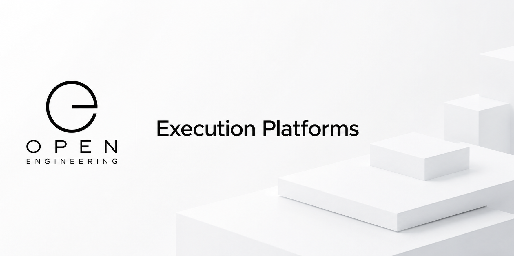

# Open Engineering Execution Platforms

Complete, deployable engineering environments that bring together infrastructure, operating systems, runtimes, and applications into executable platforms.



Open Engineering Execution Platforms is the home of reusable execution platforms within the Open Engineering ecosystem. It provides a vendor-neutral way to describe, compose, deploy, and operate complete engineering environments across cloud, edge, on-premises, and hybrid infrastructures.

Rather than defining software components in isolation, Execution Platforms describe how an entire solution is assembled and executed.

⸻

## Position within the Open Engineering Ecosystem

Execution Platforms sit at the top of the execution stack.
```
Open Engineering Ontologies
            │
            ▼
Open Engineering Elements
            │
            ▼
Open Engineering Stories
            │
            ▼
Open Engineering Characters
            │
            ▼
Open Engineering Applications
            │
            ▼
Open Engineering Runtimes
            │
            ▼
Open Engineering Operating Systems
            │
            ▼
Open Engineering Execution Platforms
```
Each layer has a distinct responsibility.
```
Organization	Responsibility
Open Engineering Ontologies	Shared engineering vocabulary
Open Engineering Elements	Reusable engineering building blocks
Open Engineering Stories	Behaviour and interactions
Open Engineering Characters	Reusable actors and personas
Open Engineering Applications	Engineering software built from reusable elements
Open Engineering Runtimes	Execute applications
Open Engineering Operating Systems	Provide platform services, orchestration, security, packaging, lifecycle management
Open Engineering Execution Platforms	Assemble complete deployable engineering environments
```
⸻

## What is an Execution Platform?

An Execution Platform combines multiple technologies into a coherent, executable system.

Typical building blocks include:

* Infrastructure
* Networking
* Storage
* Security
* Identity
* Operating systems
* Runtimes
* Applications
* Configuration
* Secrets
* Observability
* AI services
* Event infrastructure
* Deployment policies

Execution Platforms define how everything works together.

⸻

## Platform Composition

A platform may be visualized as:
```
Infrastructure
        │
        ▼
Operating System
        │
        ▼
Runtime(s)
        │
        ▼
Application(s)
        │
        ▼
Running Engineering Solution
```
For cloud-native systems this may become:
```
Cloud Provider
        │
        ▼
Kubernetes
        │
        ▼
Open Engineering Operating System
        │
        ▼
Open Engineering Runtime
        │
        ▼
Engineering Application
```
⸻

## Example Platforms

Execution Platforms can represent many deployment targets, including:

* Local development environments
* Docker Compose platforms
* Kubernetes platforms
* Edge platforms
* Raspberry Pi platforms
* AI inference platforms
* Robotics platforms
* Digital Twin platforms
* Simulation platforms
* VR/AR platforms
* Manufacturing platforms
* Industrial IoT platforms
* High-performance computing platforms

⸻

## Example Repository Structure

Execution Platforms introduce their own repository archetype within the Open Engineering Repository Convention.
```
source/
│
├── platform.yaml
├── infrastructure/
├── operating-system/
├── runtimes/
├── applications/
├── networking/
├── storage/
├── security/
├── identity/
├── observability/
├── deployment/
└── manifests/
```
The exact structure is defined by the Open Engineering conventions and evolves independently from any specific implementation.

⸻

## Design Principles

Execution Platforms embrace the core Open Engineering principles:

* Composable instead of monolithic
* Portable across environments
* Vendor-neutral
* Cloud-native
* Infrastructure as Code
* AI-native
* Observable by design
* Secure by default
* Open by design

⸻

## Relationship with Other Organizations

Execution Platforms integrate technologies from across the ecosystem.

Examples include:

* Open Engineering Operating Systems provide platform services.
* Open Engineering Runtimes execute applications.
* Open Engineering Applications provide business capabilities.
* Open Engineering Stories describe workflows and behaviour.
* Open Engineering Elements provide reusable building blocks.
* Open Engineering Ontologies provide shared semantics.

Execution Platforms do not replace these organizations—they compose them into complete, executable systems.

⸻

## Example Use Cases

An Execution Platform can describe environments such as:

* A Kubernetes platform for Product Detectives
* A Raspberry Pi platform for PixStars
* An industrial automation platform
* A cloud-native AI engineering platform
* A digital twin platform
* A robotics execution platform
* A smart factory platform
* A secure PKI demonstration platform
* A VR engineering platform
* A multi-cloud engineering platform

⸻

## Vision

Open Engineering Execution Platforms provide the final layer that transforms reusable engineering assets into complete, deployable systems.

By separating what software does (Applications), how it executes (Runtimes), which platform services it relies on (Operating Systems), and where everything is assembled and deployed (Execution Platforms), the Open Engineering ecosystem enables highly modular, composable, and portable engineering solutions.

Together, these layers make engineering systems reproducible, interoperable, and executable anywhere.
